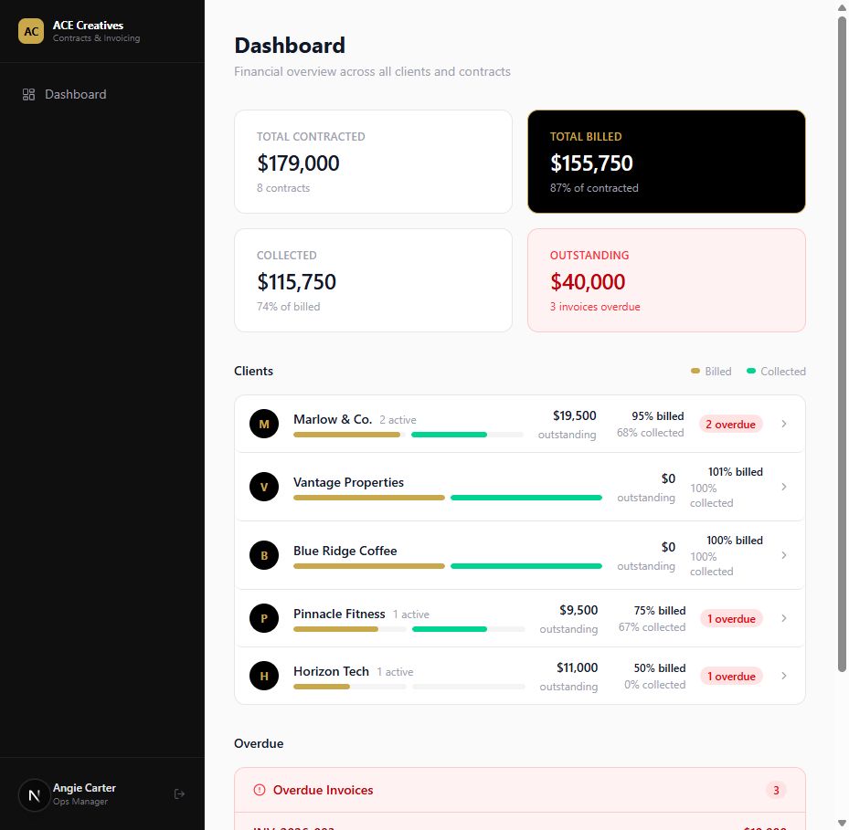
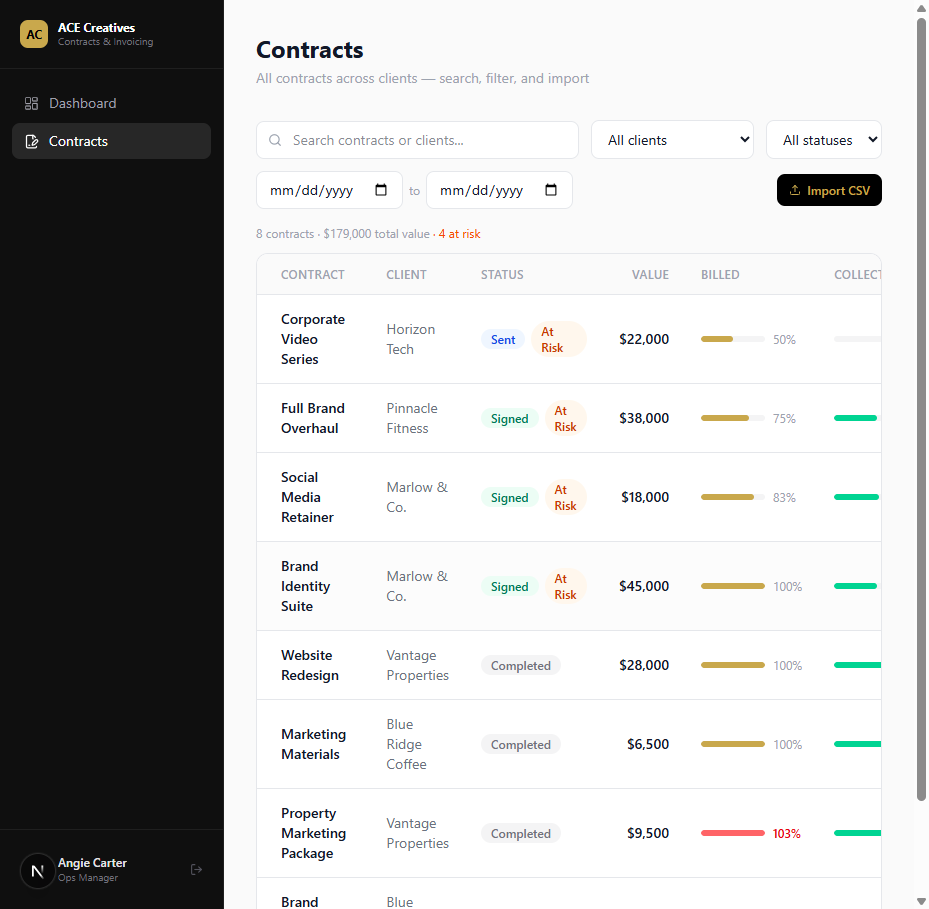
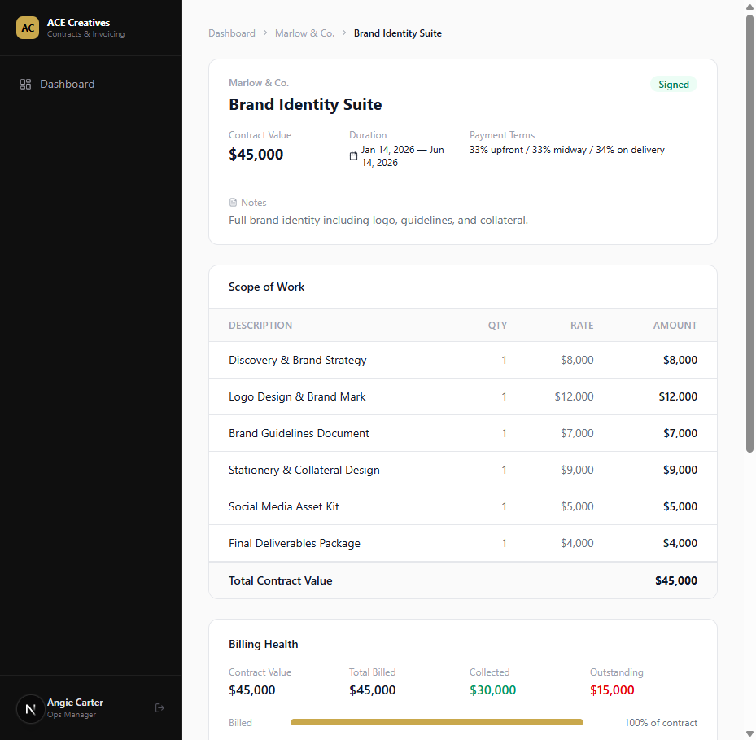

# ACE Creatives — Contract & Invoicing Visibility Tool

An internal ops tool for ACE Creatives, a creative agency. It answers one question across every client and contract: **"Have we billed correctly, what's been collected, and what's outstanding?"**

Built as a fully interactive UI demo with realistic mock data — no backend, no database. All state lives client-side and resets on refresh.



## What It Does

### Dashboard
A financial overview across all clients: total contracted, total billed, collected, and outstanding, with a per-client list showing billed/collected progress bars and a panel of overdue invoices that links straight to the offending contract.

### Contract List
Every contract across all clients in one table — status, value, billed and collected percentages, and contract period.



- **Search** by contract title or client name
- **Filter** by client, status, or a date range (matches contracts whose period overlaps the window)
- **Summary line** showing the count, total value, and at-risk count for the current filter

### At-Risk Tagging
Contracts are automatically flagged **At Risk** when they're active (signed or sent) and have an overdue invoice — including sent invoices that have quietly slipped past their due date. The tag is derived, not stored, so it's always current. It appears on the contract list, client detail cards, and the contract detail header.

### Contract Detail
The audit view for a single contract:



- Header with value, duration, payment terms, and notes
- Scope-of-work line items table
- **Billing health strip** — billed vs. contract value and collected vs. billed, with overbilling called out in red
- **Invoice table** with inline actions: add an invoice, mark paid, or record a partial payment

### CSV Import
Bulk-import contracts from a CSV (`client, title, total_value, status, start_date, end_date, payment_terms`). The import modal validates every row — required fields, positive values, valid statuses, date format — shows a preview marking each row Ready or listing its errors, and skips invalid rows. A template file is downloadable from the modal. Client names are matched case-insensitively against existing clients.

## Mock Data Scenarios

The seed data is built to exercise every billing state an ops manager would care about:

| Scenario | Where |
|---|---|
| Overbilled contract (103%) | Vantage Properties — Property Marketing Package |
| Partially paid invoice | Marlow & Co. — Social Media Retainer |
| Overdue invoices | Marlow, Pinnacle, and Horizon contracts |
| 100% billed and collected | Blue Ridge Coffee — both contracts |
| Billed but $0 collected | Horizon Tech — Corporate Video Series |

Totals: $179k contracted · $150.75k billed · $115.75k collected · $35k outstanding.

## Stack

- **Next.js 15** (App Router) + TypeScript
- **Tailwind CSS v4** — brand colors (black / gold `#C9A84C` / white) as CSS variables
- Mock data in `lib/data/mock-db.ts`; server components read it directly, client components manage local `useState`

## Running It

```bash
cd ace-contract-invoicing
npm install
npm run dev
```

Open http://localhost:3000. The `/login` page is a mock — use "Skip to demo" to enter.

## Project Structure

```
ace-contract-invoicing/
  app/(dashboard)/            Dashboard, clients/[id], contracts, contracts/[id]
  app/login/                  Mock magic-link login
  components/
    contracts/                Cards, line items, billing health, list explorer, CSV import
    dashboard/                Summary cards, client rows, overdue panel, sidebar nav
    invoices/                 Invoice table + add/pay/partial modals
    ui/                       Badge, Card, Modal
  lib/
    types.ts                  Client, Contract, Invoice, BillingMetrics
    utils.ts                  Currency/date formatting, billing math, at-risk logic
    data/mock-db.ts           5 clients, 8 contracts, 34 line items, 20 invoices
HANDOFF.md                    Session handoff notes for development
*.png                         UI screenshots
```
